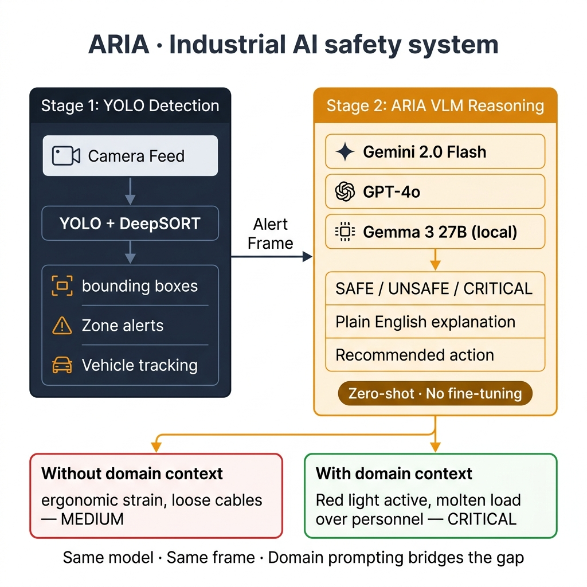

# vlm-industrial-safety

**Bridging the Domain Gap in Industrial Safety with Vision Language Models**

*CIVS × Purdue University Northwest · SDI Butler Steel Plant*

[](https://www.python.org/)
[](https://streamlit.io/)
[](LICENSE)
[]()

---

## Overview

This repository contains **ARIA** (AI Risk & Incident Analyzer) — a VLM-based reasoning layer for industrial safety monitoring, built as Stage 2 on top of an existing YOLO+DeepSORT detection system deployed at the SDI Butler steel plant.

The core research question:

> *Can a general-purpose VLM reason about plant-specific hazards — and how much of the gap between generic and domain-specific performance can be closed with prompt engineering alone, before any fine-tuning?*



### The Key Finding

Detection rate is **not** the story. A generic prompt gets ~100% "YES hazard" on industrial steel plant footage — but the *reasons are wrong* (the model invents ergonomic office hazards on a melt shop floor). Domain prompting, with zero retraining, recovers correct plant-specific reasoning:

| Condition | Response | Severity | Correct? |
|-----------|----------|----------|----------|
| Phase 2 + generic prompt | *"ergonomic strain, loose cables"* | MEDIUM | ✗ Hallucination |
| Phase 2 + domain prompt | *"red ground light, pot hauler over personnel"* | CRITICAL | ✓ Correct |

Same model. Same frame. Same zero-shot setup.

---

## System Architecture

```
Stage 1 (existing, deployed at SDI plant):
  Camera feed → YOLO + DeepSORT
  Detects: vehicles, personnel, zone violations
  Output: bounding boxes + zone alerts

Stage 2 (this project):
  Alert frame → VLM (Gemma 3 27B / Gemini 2.0 Flash / GPT-4o)
  Input: the frame that triggered the YOLO alert
  Output: plain-English WHY it's dangerous + WHAT action to take
```

YOLO detects *that* something is wrong. ARIA explains *why* — with plant-specific context, in human-readable language, to a safety officer.

---

## Experiment Design

Three phases, one research arc:

| Phase | Data | Prompt | Expected Result |
|-------|------|--------|-----------------|
| **Phase 1** | Open-source YouTube safety videos | Generic | VLM succeeds — clear, well-lit hazards |
| **Phase 2** | SDI industrial plant footage (proprietary) | Generic | VLM hallucinates — domain gap exposed |
| **Phase 2** | Same SDI footage | Domain-aware | VLM recovers — prompt bridges the gap |

**Four prompt variants** tested across all phases:

| Variant | Description |
|---------|-------------|
| `direct` | Plain question, no context — worst-case baseline |
| `domain` | Facility context + hazard definition injected |
| `cot` | Chain-of-thought, step-by-step reasoning |
| `multi_q` | Multi-question chain, structured Q&A |

**Results from 1,044 completed inferences (Gemma 3 27B, zero-shot):**

| Phase | Variant | n | Detection Rate |
|-------|---------|---|----------------|
| Phase 1 | direct | 240 | 100.0% |
| Phase 1 | domain | 240 | 90.4% |
| Phase 1 | cot | 240 | 80.0% |
| Phase 1 | multi_q | 240 | 88.8% |
| Phase 2 | direct | 21 | 100.0% ← all YES, but **wrong reasons** |
| Phase 2 | domain | 21 | 100.0% ← YES, with **correct plant reasoning** |
| Phase 2 | cot | 21 | 100.0% |
| Phase 2 | multi_q | 21 | 66.7% |

---

## Repository Structure

```
vlm-industrial-safety/
├── vlm_demo/
│   ├── app.py                      ← ARIA Streamlit demo (live chat with VLM)
│   └── pages/
│       └── 2_Domain_Gap.py         ← Research findings visualization
├── prompts/
│   ├── prompt_templates.py         ← 4-variant prompt engineering system
│   ├── hazard_library.py           ← SDI hazard definitions (text-based)
│   └── frame_selector.py           ← Frame selection + experiment queue builder
├── scripts/
│   ├── run_phase1.sh               ← End-to-end Phase 1 pipeline
│   └── run_phase2.sh               ← End-to-end Phase 2 pipeline (needs SDI footage)
├── media/
│   └── architecture.png            ← System architecture diagram
├── 02_download_youtube.py          ← Download YouTube hazard videos via yt-dlp
├── 03_extract_frames.py            ← Extract frames at 1fps (max 30 per video)
├── 04_build_metadata.py            ← Build master_metadata.csv + frames_index.csv
├── 05_vlm_inference.py             ← Batch VLM inference runner (all backends)
├── 06_results_analysis.py          ← Results aggregation + chart generation
├── manage.sh                       ← Service manager for all components
├── requirements.txt
├── LICENSE
└── README.md
```

---

## Setup

### Requirements

- Python 3.11+
- Linux (tested) or Windows with WSL
- GPU with 32GB+ VRAM recommended for local Gemma 3 27B (NVIDIA RTX 5000 Ada used in this work)
- API key for Gemini or GPT-4o (if not running locally)

### Installation

```bash
# Clone the repo
git clone https://github.com/<your-username>/vlm-industrial-safety.git
cd vlm-industrial-safety

# Install Python dependencies
pip install -r requirements.txt
```

### VLM Backend Setup

**Option A: Gemini 2.0 Flash (recommended for getting started)**
```bash
export GOOGLE_API_KEY=your_google_api_key
# No other setup needed — API call handled automatically
```

**Option B: GPT-4o**
```bash
export OPENAI_API_KEY=your_openai_api_key
```

**Option C: Local Gemma 3 27B via vLLM (used in the paper)**
```bash
# Requires ~30GB GPU VRAM
conda create -n gemmaenv python=3.11 -y
conda activate gemmaenv
pip install vllm

# Accept the model license at: https://huggingface.co/google/gemma-3-27b-it
huggingface-cli login

# Start the vLLM server (leave running in background)
vllm serve google/gemma-3-27b-it --port 8000 --host 0.0.0.0

# Optional: use manage.sh for easy service management
bash manage.sh start aria
```

---

## Datasets

### Phase 1 — Open-Source YouTube Safety Videos

Sourced automatically via `yt-dlp`. Categories:
- `PPE_violation` — workers without hard hats, high-vis vests
- `fall_from_height` — fall hazards, missing guardrails
- `machinery_danger` — unguarded rotating parts, forklift proximity
- `near_miss` — close calls, electrical hazards, falling objects

```bash
# Downloads to phase1_opensource/*/raw/
python 02_download_youtube.py
```

Additional open datasets used (download manually):
- [Mendeley Factory CCTV (Önal & Dandıl)](https://data.mendeley.com/datasets/xjmtb22pff/1)
- [Roboflow Construction Safety](https://universe.roboflow.com/roboflow-universe-projects/construction-site-safety)

### Phase 2 — SDI Butler Steel Plant Footage

Three CCTV recordings (`video-1.mkv`, `video-2.mkv`, `video-3.mkv`) from the SDI Butler melt shop bay. These are **proprietary** and not included in this repository.

If you have access, place them at:
```
your_mkv_files/raw/video-1.mkv
your_mkv_files/raw/video-2.mkv
your_mkv_files/raw/video-3.mkv
```

The key hazards captured:
- **Pot hauler with glowing molten load** — ~1500°C thermal risk
- **Camera blind spot** — ~100s gap where vehicle is invisible to primary camera
- **Multi-vehicle simultaneous operation** — highest-risk plant scenario
- **Red ground light** — facility-specific UNSAFE indicator

---

## Running the Experiment

### Phase 1 (baseline) — End-to-End

```bash
# Full pipeline: download → extract → index → infer → analyse
bash scripts/run_phase1.sh                          # vLLM default
bash scripts/run_phase1.sh --model gemini           # Gemini API
bash scripts/run_phase1.sh --model gemini --limit 20  # Quick test
```

### Phase 2 (domain gap) — Requires SDI footage

```bash
bash scripts/run_phase2.sh
bash scripts/run_phase2.sh --model gemini
```

### Run Inference Only

```bash
# Resume from where you left off (skips completed rows)
python 05_vlm_inference.py --model vllm --phase 1 --resume

# Run specific phase + variant
python 05_vlm_inference.py --model gemini --phase 2 --variant domain

# Quick cost-control test (5 rows only)
python 05_vlm_inference.py --model gemini --limit 5
```

### Analyse Results

```bash
python 06_results_analysis.py
# → plots/detection_by_variant.png
# → plots/domain_gap_analysis.png
# → results/report.html
```

---

## Live Demo

Launch the ARIA interactive demo:

```bash
streamlit run vlm_demo/app.py --server.port 8501
# Open http://localhost:8501
```

The demo includes:
1. **ARIA Chat** — select any clip, ask questions, get live VLM reasoning
2. **Domain Gap page** — research findings visualized from real inference data

**The key demo moment:** select *"SDI Plant — Vehicle Re-emerges from Blind Spot with Glowing Pot"*, then toggle domain context ON/OFF to see the model shift from *"ergonomic strain, loose cables — MEDIUM"* to *"Red light active, molten load over personnel — CRITICAL"* with zero code changes.

**Optional: Enable general video understanding**
```bash
export EGO_VIDEO_PATH=/path/to/your/video.mp4
streamlit run vlm_demo/app.py
# A "General Video Understanding" clip will appear in the selector
```

---

## Prompt Engineering

The four prompt variants are in `prompts/prompt_templates.py`. Each can be used standalone:

```python
from prompts.prompt_templates import build_prompt

# Generic baseline (no context)
prompt = build_prompt("direct", mode="generic")

# Domain-aware (SDI plant context injected)
prompt = build_prompt("domain", mode="sdi", hazard_key="red_light_indicator")

# Chain-of-thought
prompt = build_prompt("cot", mode="sdi", hazard_key="blind_spot_vehicle")

# Multi-question structured
prompt = build_prompt("multi_q", mode="sdi", hazard_key="missing_blockers")
```

Available hazard keys:

| Key | Description |
|-----|-------------|
| `ppe_no_helmet` | PPE violation — no hard hat |
| `fall_from_height` | Fall hazard or near-miss |
| `forklift_pedestrian` | Forklift and pedestrian proximity |
| `people_with_active_equipment` | SDI — personnel in active bay |
| `missing_blockers` | SDI — blockers absent at designated positions |
| `blind_spot_vehicle` | SDI — heavy equipment at camera blind spot |
| `red_light_indicator` | SDI — red ground light active |

---

## Service Management

The `manage.sh` script manages all components:

```bash
bash manage.sh start aria      # Start Gemma vLLM + ARIA Streamlit
bash manage.sh stop aria       # Stop both
bash manage.sh status          # Service health + GPU memory
bash manage.sh logs            # Tail logs
bash manage.sh                 # Interactive menu
```

---

## Citation

If you use this work, please cite:

```bibtex
@misc{aria-vlm-hazard-2025,
  title   = {Bridging the Domain Gap in Industrial Safety with
             Vision Language Models and Prompt Engineering},
  author  = {CIVS, Purdue University Northwest},
  year    = {2025},
  note    = {Demonstrated at SDI Butler Steel Plant.
             \url{https://github.com/<your-username>/vlm-industrial-safety}}
}
```

---

## Acknowledgements

- **SDI (Steel Dynamics Inc.)** — for providing plant access and CCTV footage
- **CIVS (Center for Innovation through Visualization and Simulation)** at Purdue University Northwest — for research support and infrastructure
- **Google** — Gemma 3 27B model weights (via HuggingFace)
- **vLLM** — high-throughput local VLM inference server
- The existing YOLO + DeepSORT system (Stage 1) was built by the CIVS team

---

*CIVS × Purdue University Northwest · SDI Butler Steel Plant*
